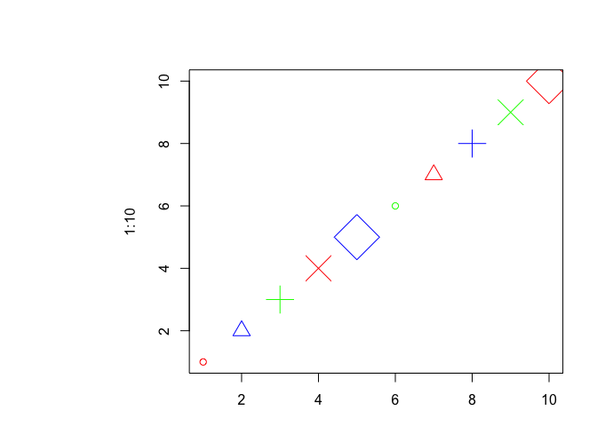
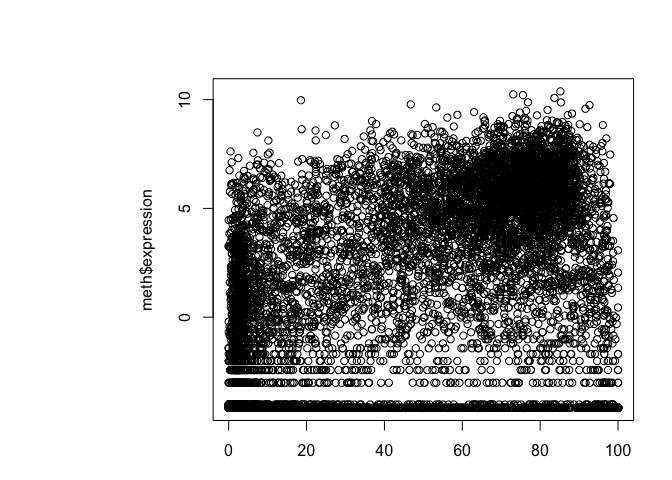

Class 5
================
barry
Thu Nov 1 11:49:26 2018

This is **regular text** like we could have in a Rmd document

``` r
# 1A Lineplot
# Baby weight data input
weight <- read.table("bimm143_05_rstats/weight_chart.txt", header = TRUE)

# Make a custom plot
plot(weight, typ="b", pch=15, col="blue", main="Baby weight over time",
     xlab="Age (Months)", ylab="Weight (kg)")
```


``` r
# 1B Barplot
counts <- read.table("bimm143_05_rstats/feature_counts.txt", 
                     header=TRUE, sep="\t")


barplot(counts$Count, names.arg = counts$Feature, horiz=TRUE, las=1)
```


``` r
par(mar=c(3.1, 11.1, 4.1, 2))
barplot(counts$Count, names.arg=counts$Feature, 
        horiz=TRUE, ylab="", 
        main="Number of features in the mouse GRCm38 genome", 
        las=1, xlim=c(0,80000))
```


``` r
# 2C histograms
hist( c(rnorm(10000),rnorm(10000)+4), main="breaks default" )
```


``` r
hist( c(rnorm(10000),rnorm(10000)+4), breaks=30, main="breaks=30")
```


``` r
## Plot characters
plot( 1:5, pch=1:5, cex=1:5 ) 
```


``` r
# Look recycling, WOW!
plot( 1:10, pch=1:5, cex=1:5 ) 
```


``` r
plot( 1:10, pch=1:5, cex=1:5, col=c("red","blue", "green") ) 
```



``` r
## Boxplot
boxplot( cbind( rnorm(1000,0), rnorm(1000,4) ) )
```


``` r
# Section 3
mf <- read.table("bimm143_05_rstats/male_female_counts.txt", sep="\t", header = TRUE)

barplot(mf$Count, names.arg = mf$Sample, las=2, col=rainbow( nrow(mf) ))
```


``` r
barplot(mf$Count, names.arg = mf$Sample, las=2, col=c("red","blue"))
```


``` r
# 3B Color by value
genes <- read.delim("bimm143_05_rstats/up_down_expression.txt")

# How many genes are in this dataset
nrow(genes)
```

    ## [1] 5196

``` r
# How many are up, down and all around?
table(genes$State)
```

    ## 
    ##       down unchanging         up 
    ##         72       4997        127

``` r
## Lets plot this data
plot(genes$Condition1, genes$Condition2, col=genes$State)
```


``` r
# What are the default colors
palette()
```

    ## [1] "black"   "red"     "green3"  "blue"    "cyan"    "magenta" "yellow" 
    ## [8] "gray"

``` r
# Change the color palette to more useful colors for me!
palette(c("red","gray","blue")) 
plot(genes$Condition1, genes$Condition2, col=genes$State)
```


``` r
# 3C Dynamic use of color
meth <- read.delim("bimm143_05_rstats/expression_methylation.txt")

# How many genes
nrow(meth)
```

    ## [1] 9241

``` r
# First plot
plot(meth$gene.meth, meth$expression)
```



``` r
# Better but still not very useful
mycols <- densCols(meth$gene.meth, meth$expression)
plot(meth$gene.meth, meth$expression, col=mycols)
```


``` r
# Lets focus on the data we want to examine

inds <- meth$expression > 0
mycols2 <- densCols(meth$gene.meth[inds], meth$expression[inds])

plot(meth$gene.meth[inds], meth$expression[inds], col=mycols2)
```


