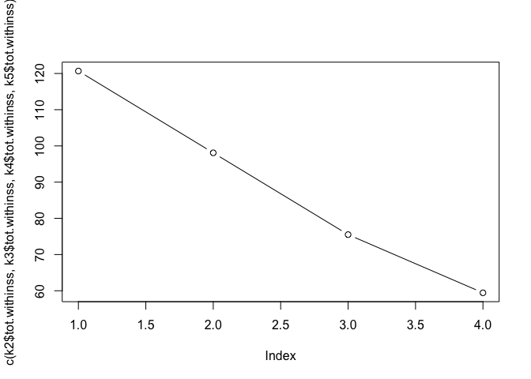
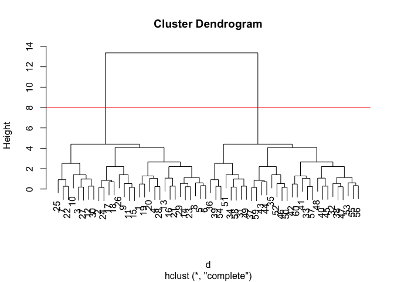

Class 8
================
Barry Grant
10/25/2018

K-means clustering
------------------

Our first example with **kmeans()** function.

``` r
# Example plot to see how Rmarkdown works
plot(1:10, typ="l")
```


Back to kmeans...

``` r
# Generate some example data for clustering
tmp <- c(rnorm(30,-3), rnorm(30,3))
x <- cbind(x=tmp, y=rev(tmp))

plot(x)
```


Use the kmeans() function setting k to 2 and nstart=20

Inspect/print the results

``` r
k <- kmeans(x, centers = 2, nstart = 20)
k
```

    ## K-means clustering with 2 clusters of sizes 30, 30
    ## 
    ## Cluster means:
    ##           x         y
    ## 1 -3.164295  3.117401
    ## 2  3.117401 -3.164295
    ## 
    ## Clustering vector:
    ##  [1] 1 1 1 1 1 1 1 1 1 1 1 1 1 1 1 1 1 1 1 1 1 1 1 1 1 1 1 1 1 1 2 2 2 2 2
    ## [36] 2 2 2 2 2 2 2 2 2 2 2 2 2 2 2 2 2 2 2 2 2 2 2 2 2
    ## 
    ## Within cluster sum of squares by cluster:
    ## [1] 60.33906 60.33906
    ##  (between_SS / total_SS =  90.7 %)
    ## 
    ## Available components:
    ## 
    ## [1] "cluster"      "centers"      "totss"        "withinss"    
    ## [5] "tot.withinss" "betweenss"    "size"         "iter"        
    ## [9] "ifault"

Q. How many points are in each cluster?

``` r
k$size
```

    ## [1] 30 30

Q. What ‘component’ of your result object details - cluster size? - `k$size` - cluster assignment/membership? - cluster center?

``` r
k$cluster
```

    ##  [1] 1 1 1 1 1 1 1 1 1 1 1 1 1 1 1 1 1 1 1 1 1 1 1 1 1 1 1 1 1 1 2 2 2 2 2
    ## [36] 2 2 2 2 2 2 2 2 2 2 2 2 2 2 2 2 2 2 2 2 2 2 2 2 2

``` r
table(k$cluster)
```

    ## 
    ##  1  2 
    ## 30 30

``` r
k$centers
```

    ##           x         y
    ## 1 -3.164295  3.117401
    ## 2  3.117401 -3.164295

Plot x colored by the kmeans cluster assignment and add cluster centers as blue points

``` r
palette(c("blue", "red"))
plot(x, col=k$cluster)
points(k$centers, col="green", pch=20, cex=3)
```


Q. Repeat for k=3, which has the lower tot.withinss?

``` r
k2 <- kmeans(x, centers = 2, nstart = 20)
k3 <- kmeans(x, centers = 3, nstart = 20)
k4 <- kmeans(x, centers = 4, nstart = 20)
k5 <- kmeans(x, centers = 5, nstart = 20)

k2$tot.withinss
```

    ## [1] 120.6781

``` r
k3$tot.withinss
```

    ## [1] 98.09108

``` r
k4$tot.withinss
```

    ## [1] 75.50404

``` r
k5$tot.withinss
```

    ## [1] 59.43317

``` r
plot( c( k2$tot.withinss, k3$tot.withinss, k4$tot.withinss, k5$tot.withinss), typ="b")
```



Hierarchical clustering in R
============================

Let's try out the **hclust()** function for Hierarchical clustering in R. This function need a distance matrix as input!

``` r
d <- dist(x)
hc <- hclust(d)
plot(hc)
```


``` r
plot(hc)
# Draw a line on the dendrogram
abline(h=8, col="red")
```



``` r
# Cut the tre to yield cluster membership vector
#cutree(hc, h=8)
cutree(hc, k=2)
```

    ##  [1] 1 1 1 1 1 1 1 1 1 1 1 1 1 1 1 1 1 1 1 1 1 1 1 1 1 1 1 1 1 1 2 2 2 2 2
    ## [36] 2 2 2 2 2 2 2 2 2 2 2 2 2 2 2 2 2 2 2 2 2 2 2 2 2

### A more 'real' example of data clustering

``` r
# Step 1. Generate some example data for clustering
x <- rbind(
  matrix(rnorm(100, mean=0, sd = 0.3), ncol = 2),   # c1
  matrix(rnorm(100, mean = 1, sd = 0.3), ncol = 2), # c2
  matrix(c(rnorm(50, mean = 1, sd = 0.3),           # c3
           rnorm(50, mean = 0, sd = 0.3)), ncol = 2))
colnames(x) <- c("x", "y")

# Step 2. Plot the data without clustering
plot(x)
```


``` r
# Step 3. Generate colors for known clusters 
#         (just so we can compare to hclust results)
col <- as.factor( rep(c("c1","c2","c3"), each=50) ) 

palette( c("red","blue","black"))
plot(x, col=col, pch=20)
```


Or more simple plot by grp

``` r
grp.names <- rep( c("red", "blue", "black"), each=50)
plot(x, col=grp.names, pch=20)
```


Q. Use the dist(), hclust(), plot() and cutree() functions to return 2 and 3 clusters

``` r
d <- dist(x)
hc <- hclust(d)
plot(hc)
```


Use cutree() functions to return 2 and 3 clusters

``` r
grp.2 <- cutree(hc, k=2)
grp.3 <- cutree(hc, k=3)
plot(x, col=grp.3, pch=20)
```


Q. How does this compare to your known 'col' groups?

``` r
# Use the table() function!!
table(grp.3, col)
```

    ##      col
    ## grp.3 c1 c2 c3
    ##     1 49  0  5
    ##     2  1  0 36
    ##     3  0 50  9

Principal component analysis
============================

Lets make up some data with quite a few dimensions

``` r
## Initialize a blank 100 row by 10 column matrix
mydata <- matrix(nrow=100, ncol=10)

## Lets label the rows gene1, gene2 etc. to gene100
rownames(mydata) <- paste("gene", 1:100, sep="")

## Lets label the first 5 columns wt1, wt2, wt3, wt4 and wt5
##   and the last 5 ko1, ko2 etc. to ko5 (for "knock-out") 
colnames(mydata) <- c( paste("wt", 1:5, sep=""),
                       paste("ko", 1:5, sep="") )

## Fill in some fake read counts
for(i in 1:nrow(mydata)) {
  wt.values <- rpois(5, lambda=sample(x=10:1000, size=1))
  ko.values <- rpois(5, lambda=sample(x=10:1000, size=1))

  mydata[i,] <- c(wt.values, ko.values)
}

head(mydata)
```

    ##       wt1 wt2 wt3 wt4 wt5 ko1 ko2 ko3 ko4 ko5
    ## gene1 983 972 910 988 971 683 711 693 715 696
    ## gene2  44  44  43  49  33 310 255 290 304 276
    ## gene3 195 206 251 211 202  51  59  55  54  57
    ## gene4 891 903 886 934 954 152 162 146 130 144
    ## gene5 701 693 697 697 710  61  55  53  50  61
    ## gene6 371 374 401 390 422  15   9  15  18  15

Note the prcomp() functions wants us to take the transpose of our data so we have fliped rows and cols...

``` r
head(t(mydata))
```

    ##     gene1 gene2 gene3 gene4 gene5 gene6 gene7 gene8 gene9 gene10 gene11
    ## wt1   983    44   195   891   701   371   362   693   939    383     20
    ## wt2   972    44   206   903   693   374   388   651   930    388     24
    ## wt3   910    43   251   886   697   401   386   658   917    393     23
    ## wt4   988    49   211   934   697   390   346   703   914    393     15
    ## wt5   971    33   202   954   710   422   415   676   945    418     30
    ## ko1   683   310    51   152    61    15   782   328   670    325    256
    ##     gene12 gene13 gene14 gene15 gene16 gene17 gene18 gene19 gene20 gene21
    ## wt1     40    252    167    974    117    856    704    772    554    547
    ## wt2     39    244    123    979    111    868    645    842    599    544
    ## wt3     48    233    143    929    122    871    703    806    545    583
    ## wt4     48    234    168    969     97    840    650    802    589    535
    ## wt5     54    253    155    998    113    863    696    832    544    555
    ## ko1    221    733    304    284    615     16    206    441    653    145
    ##     gene22 gene23 gene24 gene25 gene26 gene27 gene28 gene29 gene30 gene31
    ## wt1    931    478    494    473    899    239    737    959    477     55
    ## wt2    961    515    425    451    912    224    651    994    517     51
    ## wt3    896    467    445    444    922    210    778    990    506     47
    ## wt4    943    476    471    432    898    228    714    982    528     53
    ## wt5    922    474    462    440    904    233    737    998    513     48
    ## ko1    278    695    161   1005    652    150    100    845    248    297
    ##     gene32 gene33 gene34 gene35 gene36 gene37 gene38 gene39 gene40 gene41
    ## wt1    105    175    322    522    122   1021    927    313    580    157
    ## wt2    101    191    363    527    131    929    956    264    546    158
    ## wt3    127    166    345    517    119    935    927    320    563    147
    ## wt4    114    147    331    537    133    958    939    330    562    146
    ## wt5    135    172    362    562    140    953    918    309    524    153
    ## ko1    258     85     66    571    853    431    966    372    823    459
    ##     gene42 gene43 gene44 gene45 gene46 gene47 gene48 gene49 gene50 gene51
    ## wt1    693    131    553    756    483    222    800    200     47    866
    ## wt2    673    140    535    684    519    245    787    182     45    933
    ## wt3    634    145    518    696    496    214    778    195     31    892
    ## wt4    667    136    529    707    500    207    824    166     41    859
    ## wt5    678    136    574    682    476    239    785    174     40    893
    ## ko1    297    412    556    246    818    700    349    948    734    376
    ##     gene52 gene53 gene54 gene55 gene56 gene57 gene58 gene59 gene60 gene61
    ## wt1    151    477    850    265    719    466    868    887    746    312
    ## wt2    135    476    814    309    715    463    871    881    705    343
    ## wt3    163    504    721    305    704    482    893    838    706    344
    ## wt4    143    483    858    309    664    456    849    809    718    346
    ## wt5    156    512    778    293    711    429    887    821    775    350
    ## ko1    375    253    858    152    339    860    459    412   1032    687
    ##     gene62 gene63 gene64 gene65 gene66 gene67 gene68 gene69 gene70 gene71
    ## wt1    363   1017    330    694    183    143    281    590    193    311
    ## wt2    386    964    274    718    202    153    335    588    201    318
    ## wt3    400    990    319    704    213    133    326    603    202    315
    ## wt4    435    984    351    697    198    134    288    567    183    319
    ## wt5    413    948    321    722    198    133    289    599    227    347
    ## ko1    706    715    807    627    387    294    145     68    294    594
    ##     gene72 gene73 gene74 gene75 gene76 gene77 gene78 gene79 gene80 gene81
    ## wt1    269    337    770    259    585    452    872    332     66    895
    ## wt2    286    369    781    244    627    469    845    335     46    907
    ## wt3    311    359    794    258    642    446    844    306     51    969
    ## wt4    317    383    742    253    664    467    861    296     48    960
    ## wt5    257    369    805    250    611    456    848    304     61    885
    ## ko1    418     44    644    895    665    844    681     11    313    336
    ##     gene82 gene83 gene84 gene85 gene86 gene87 gene88 gene89 gene90 gene91
    ## wt1    839    375    360    769    829    205    909    824     97    443
    ## wt2    819    382    381    748    776    202    913    865    104    479
    ## wt3    812    390    366    798    820    199    984    857    105    435
    ## wt4    862    372    380    777    849    210    975    849    107    449
    ## wt5    770    351    362    788    896    172    890    894    117    527
    ## ko1    625    866    849    141    894     94    785    240    438    266
    ##     gene92 gene93 gene94 gene95 gene96 gene97 gene98 gene99 gene100
    ## wt1    884    853    663    679    253    133    992    390      58
    ## wt2    876    813    698    704    266    119    912    332      57
    ## wt3    912    834    708    737    283    132    948    363      47
    ## wt4    868    798    665    769    253    123    963    377      57
    ## wt5    904    879    726    740    249    126    832    354      49
    ## ko1    712    618    558    620    220    868    531    496     389

Now lets try to find "structure" in this data with **prcomp()**

``` r
pca <- prcomp(t(mydata), scale=TRUE)
pca
```

    ## Standard deviations (1, .., p=10):
    ##  [1] 9.611819e+00 1.468518e+00 1.293128e+00 1.046653e+00 9.236956e-01
    ##  [6] 8.072783e-01 7.148688e-01 6.216863e-01 5.350554e-01 3.149007e-15
    ## 
    ## Rotation (n x k) = (100 x 10):
    ##                 PC1           PC2           PC3           PC4
    ## gene1   -0.10249517  0.0162737817 -0.0317481302  0.1433193569
    ## gene2    0.10335955 -0.0072439854 -0.0073209338 -0.0187240998
    ## gene3   -0.10259671 -0.0186975495  0.0686479250 -0.1093521214
    ## gene4   -0.10382752  0.0128986788 -0.0137821553  0.0256123725
    ## gene5   -0.10397795  0.0124567234 -0.0127356916  0.0063180951
    ## gene6   -0.10373898  0.0345744609  0.0099864722 -0.0059246657
    ## gene7    0.10342072  0.0112393642 -0.0139783635 -0.0442352971
    ## gene8   -0.10324461 -0.0051762008 -0.0055024323  0.0680823447
    ## gene9   -0.10256891 -0.0258909451  0.0161181103  0.0965126272
    ## gene10  -0.09350697  0.1658092213  0.2165897427  0.1198918093
    ## gene11   0.10375823 -0.0096637027  0.0135842392 -0.0196634546
    ## gene12   0.10342172 -0.0136844258  0.0445570475  0.0119008823
    ## gene13   0.10387759  0.0085235680 -0.0018576374 -0.0023268677
    ## gene14   0.10268922  0.0375265321  0.0076629934  0.0828116117
    ## gene15  -0.10384193  0.0184823347 -0.0243974342  0.0305309466
    ## gene16   0.10390865 -0.0081261282 -0.0025232562 -0.0216428452
    ## gene17  -0.10402564  0.0066184807 -0.0073465450 -0.0051969802
    ## gene18  -0.10371596  0.0261407535 -0.0017730882 -0.0004862256
    ## gene19  -0.10311619  0.0309676786  0.0024509620 -0.0155866346
    ## gene20   0.09822785 -0.0536978195  0.0027904287  0.0162879900
    ## gene21  -0.10386973  0.0064152347 -0.0036813026 -0.0404353435
    ## gene22  -0.10368236  0.0080180464 -0.0159813692  0.0126865069
    ## gene23   0.10228055 -0.0150489831  0.0652655418  0.0107414060
    ## gene24  -0.10289507  0.0354193136 -0.0203622981  0.0874896735
    ## gene25   0.10372449 -0.0246064924 -0.0246259869 -0.0019847439
    ## gene26  -0.10308561 -0.0012684886  0.0315100537  0.0091586078
    ## gene27  -0.10182267 -0.0010063733 -0.0670494780  0.1314664400
    ## gene28  -0.10353256  0.0270658056  0.0191139879 -0.0066910415
    ## gene29  -0.10224644  0.0491011577 -0.0341199391 -0.0588595109
    ## gene30  -0.10334402 -0.0051929878 -0.0213252252  0.0016649627
    ## gene31   0.10354243 -0.0336363549  0.0369485484  0.0200857063
    ## gene32   0.10239417  0.0317598914  0.1092312043 -0.0127612868
    ## gene33  -0.10100182 -0.0059425635 -0.0486502074 -0.0326184037
    ## gene34  -0.10374735  0.0154712687 -0.0064450166 -0.0191861186
    ## gene35   0.07595491  0.3570619572  0.0808106824  0.1180570546
    ## gene36   0.10397404  0.0013647888  0.0099122275  0.0042111069
    ## gene37  -0.10327792  0.0379746200 -0.0067309250  0.0614804533
    ## gene38  -0.01248088 -0.3341584406 -0.5977221621 -0.2796261463
    ## gene39   0.08642698  0.2218532378  0.0310900688 -0.0613516242
    ## gene40   0.10188474 -0.0289855686  0.0472860889 -0.0233453016
    ## gene41   0.10305023  0.0219188790  0.0395554296  0.0098511014
    ## gene42  -0.10347763  0.0085396434 -0.0040936732  0.0912004103
    ## gene43   0.10321608 -0.0506274771 -0.0179061248 -0.0425307330
    ## gene44   0.03766468  0.5225108461 -0.3516269146  0.1212182752
    ## gene45  -0.10340631 -0.0174057188  0.0108964273  0.0638467221
    ## gene46   0.10328873 -0.0378455605 -0.0085485216 -0.0611057302
    ## gene47   0.10380016 -0.0035868279 -0.0103283567 -0.0074091518
    ## gene48  -0.10357507  0.0169952621 -0.0235909160  0.0174419093
    ## gene49   0.10380194 -0.0193778658  0.0108625360 -0.0112888737
    ## gene50   0.10397519  0.0030866338  0.0148758352  0.0016989360
    ## gene51  -0.10370087  0.0063840708  0.0002550940 -0.0106830776
    ## gene52   0.10371910  0.0171209599  0.0263047895 -0.0357372598
    ## gene53  -0.10331988  0.0502211201 -0.0073995756 -0.0311441975
    ## gene54   0.04937157 -0.3002582275 -0.1893741611  0.6769018972
    ## gene55  -0.10142438  0.0099202938  0.0593842663 -0.0359529960
    ## gene56  -0.10367646  0.0277943600 -0.0380851977 -0.0239426941
    ## gene57   0.10328225 -0.0493963504 -0.0291439554 -0.0577579876
    ## gene58  -0.10347498  0.0476270619 -0.0021826562 -0.0472799878
    ## gene59  -0.10346192 -0.0101573719 -0.0190925784  0.0095839220
    ## gene60   0.10171221  0.0183435068  0.0146392658  0.0677116113
    ## gene61   0.10357035 -0.0007019565  0.0490580640 -0.0122395776
    ## gene62   0.10335242  0.0010128377  0.0427440561  0.0114435787
    ## gene63  -0.10199607  0.0019058604 -0.0217676896  0.0380140373
    ## gene64   0.10367398 -0.0057335165  0.0326534534  0.0375825609
    ## gene65  -0.10065286  0.1062969019 -0.0303625429 -0.0692073673
    ## gene66   0.10278202  0.0219542819  0.0311174623 -0.0548783455
    ## gene67   0.10254765 -0.0673126494  0.0151290329  0.0520669195
    ## gene68  -0.10203115 -0.0428625364  0.0305350804 -0.1179309916
    ## gene69  -0.10394585  0.0157332491  0.0097114676 -0.0105849764
    ## gene70   0.09611696  0.0861000731 -0.1393330548 -0.1823791371
    ## gene71   0.10334658  0.0353134484 -0.0421257601 -0.0331141068
    ## gene72   0.09911326 -0.1363590100  0.1036098796 -0.0101998927
    ## gene73  -0.10366480  0.0056827869 -0.0094479459 -0.0066834493
    ## gene74  -0.10129323  0.0852004618  0.0043082459 -0.1235668239
    ## gene75   0.10364205 -0.0156376781 -0.0003075212  0.0059793205
    ## gene76   0.08113874 -0.0763187059  0.2496240421  0.0011545075
    ## gene77   0.10218506 -0.0038109604  0.0818676613  0.0786000717
    ## gene78  -0.10165585 -0.0574294567  0.0342039610  0.1095829862
    ## gene79  -0.10378714 -0.0057163779 -0.0232803680  0.0129749360
    ## gene80   0.10369380 -0.0070458801  0.0139026837  0.0218322715
    ## gene81  -0.10363259 -0.0158794124  0.0193778934 -0.0278547702
    ## gene82  -0.09976210 -0.1184219214 -0.0453517326  0.0697164628
    ## gene83   0.10361353  0.0100181065  0.0127409862 -0.0341939094
    ## gene84   0.10370035 -0.0167073039  0.0274992344 -0.0012193527
    ## gene85  -0.10384608  0.0234070795  0.0098032760 -0.0106845501
    ## gene86   0.08484809  0.2555015375  0.1137109123  0.0894196991
    ## gene87  -0.10070562 -0.0788692952  0.0717542399  0.0475218283
    ## gene88  -0.09355034 -0.1260591718  0.1523682461 -0.1193127331
    ## gene89  -0.10380676  0.0198558794  0.0068494592  0.0019002481
    ## gene90   0.10383342  0.0229413140 -0.0054408421 -0.0226940227
    ## gene91  -0.10046410  0.0340534332 -0.0097172016  0.0794235600
    ## gene92  -0.09814091  0.0890128309  0.1928429367 -0.0166819010
    ## gene93  -0.10051728  0.1506624670  0.0385828578  0.0500696994
    ## gene94  -0.09748977  0.1126521433 -0.0877315250 -0.2038808698
    ## gene95  -0.08150826 -0.1627979799  0.1945346312  0.2038438559
    ## gene96  -0.07417750 -0.2092930933  0.3652548260 -0.2554283053
    ## gene97   0.10392591 -0.0040188765 -0.0157835529 -0.0168049829
    ## gene98  -0.10196735 -0.0655559384  0.0079868977  0.0385101908
    ## gene99   0.10056965  0.0367508756 -0.0487397267  0.0271033762
    ## gene100  0.10372845 -0.0182522453  0.0271981591  0.0063265386
    ##                   PC5           PC6           PC7          PC8
    ## gene1   -0.0269687604 -0.0040604376  0.0137788785  0.072712923
    ## gene2   -0.0096840590  0.0111418863  0.1358406207 -0.083969338
    ## gene3   -0.0530919086 -0.0398541761 -0.0384240737 -0.041939633
    ## gene4   -0.0122088620  0.0048987749 -0.0460360146 -0.033619642
    ## gene5   -0.0026222105 -0.0184905644 -0.0105829737 -0.016879051
    ## gene6   -0.0120541456  0.0093704762 -0.0347507548 -0.068067611
    ## gene7    0.0351668055  0.0950110704 -0.0487666355 -0.022371740
    ## gene8    0.0027298606 -0.0891378841 -0.0904516179 -0.007033161
    ## gene9    0.0531203163  0.0921923018 -0.0824280641  0.009476121
    ## gene10   0.0195166506  0.2133452747 -0.0624177956 -0.044530629
    ## gene11   0.0625104437  0.0299129317 -0.0228617168 -0.011776215
    ## gene12   0.0400628191  0.0582279557  0.0174534638 -0.103472684
    ## gene13   0.0116538400  0.0050691973 -0.0437351002  0.063136352
    ## gene14  -0.0307914062 -0.0890467786  0.0546033152 -0.134775201
    ## gene15   0.0051286852  0.0075455788  0.0082528237 -0.013932375
    ## gene16   0.0181729948  0.0253162940  0.0084129408 -0.017008808
    ## gene17   0.0007531836 -0.0057529136 -0.0005069875 -0.002401723
    ## gene18   0.0245447933 -0.0308457397 -0.0043433165 -0.059529972
    ## gene19  -0.0330944125  0.0959652521  0.1015211203 -0.034691483
    ## gene20  -0.0946780888 -0.0248987852  0.0453485613  0.366384860
    ## gene21   0.0085839797 -0.0217578396 -0.0168746673 -0.043120382
    ## gene22   0.0077177837 -0.0264272610  0.0393769501  0.027487485
    ## gene23   0.0758952685  0.0340631143  0.0282117476  0.190456100
    ## gene24  -0.0428749691 -0.0847272584 -0.0135986659 -0.015726878
    ## gene25   0.0237274443  0.0163379611 -0.0280755581  0.011791967
    ## gene26  -0.0320930224  0.0750725040  0.1259504118 -0.074494642
    ## gene27   0.1019997448 -0.0067562052  0.0314741310 -0.112441344
    ## gene28  -0.0140636223 -0.0561621151 -0.0185364358 -0.086176097
    ## gene29  -0.1331751389  0.1099147213 -0.0163869541 -0.012865894
    ## gene30  -0.0940163015  0.0571272325  0.0051570065 -0.070176769
    ## gene31   0.0651615669  0.0092284029 -0.0265350376  0.016851680
    ## gene32   0.0712758706  0.0149333676 -0.0738868527 -0.028775107
    ## gene33   0.1427339691  0.1289293027  0.0045247353  0.243193842
    ## gene34  -0.0074867706  0.0760512983 -0.0217580222  0.014106350
    ## gene35  -0.2490718293  0.1932230777  0.3901759107 -0.033398838
    ## gene36  -0.0077835443  0.0303123891 -0.0085401971  0.022904778
    ## gene37   0.0090965868 -0.0920158472  0.0417184472  0.033933988
    ## gene38  -0.2125542110  0.1033525079 -0.0962585272 -0.069471512
    ## gene39  -0.2641004972 -0.4499963087  0.0013815801 -0.130095513
    ## gene40   0.1000455177 -0.1535774590 -0.0657263209  0.121516817
    ## gene41  -0.0066313054 -0.0096815485 -0.0629250442  0.181037758
    ## gene42   0.0263226547  0.0084265748  0.0043107833  0.045791034
    ## gene43   0.0467177675  0.0139281541 -0.1027365328 -0.028821197
    ## gene44  -0.0019791186  0.0030396397 -0.2497264152  0.250258571
    ## gene45   0.0497837622 -0.0811446211  0.0048824334  0.009721560
    ## gene46   0.0399846983 -0.0108750101  0.0190395834  0.022758816
    ## gene47   0.0148557043  0.0573308712 -0.0326515544  0.050700281
    ## gene48  -0.0374811320 -0.0709758543  0.0219993427 -0.009733871
    ## gene49   0.0441353508  0.0199513025  0.0381112333 -0.036314437
    ## gene50   0.0091199856  0.0137339519  0.0290432011  0.022658193
    ## gene51  -0.0193630316  0.0605547524 -0.0099514258  0.094189539
    ## gene52   0.0253421467 -0.0277846595 -0.0517873758  0.003073936
    ## gene53  -0.0314540762  0.0193523168  0.0257023831 -0.121777900
    ## gene54   0.0694601174 -0.0461833366  0.0328638346  0.017695581
    ## gene55  -0.1907878663  0.0766454297 -0.0212275385  0.113173615
    ## gene56   0.0356275080  0.0016068103  0.0395135464  0.010369124
    ## gene57   0.0076976019 -0.0081131911  0.0431482734 -0.066850173
    ## gene58   0.0099865564 -0.0221267071  0.0636347854 -0.033387408
    ## gene59   0.0637315138 -0.0094857564  0.1015160302  0.056177108
    ## gene60   0.1387768195  0.0793036651  0.0511989502 -0.203263078
    ## gene61   0.0001103886  0.0320739182 -0.0642573873  0.060182758
    ## gene62  -0.0765316154  0.0320899134 -0.0834770613 -0.010442650
    ## gene63  -0.0851925206 -0.1295868445 -0.0107751167  0.106547898
    ## gene64  -0.0054764502 -0.0148159466  0.0197932186 -0.088032453
    ## gene65  -0.0454827404  0.1400278978 -0.0912437560  0.171355613
    ## gene66  -0.0802043344  0.0736274181  0.1221363922 -0.041656795
    ## gene67   0.0335983018  0.1207515516  0.0264942209  0.043274660
    ## gene68  -0.0390155438  0.0939174027  0.0084048925  0.163236670
    ## gene69   0.0287906060 -0.0117258945  0.0073491685 -0.008126503
    ## gene70   0.1468313788  0.0929505259 -0.2336596670 -0.137463222
    ## gene71  -0.0048436577  0.0567305288  0.0099029069 -0.101137234
    ## gene72  -0.0908936105 -0.0463556911 -0.2044642085  0.101182112
    ## gene73  -0.0412493410  0.0003959525 -0.0067845269 -0.040544612
    ## gene74   0.1293020628  0.0807552154 -0.0082888154 -0.053068158
    ## gene75  -0.0081925068  0.0486601688  0.0546982612 -0.070395245
    ## gene76  -0.5525089562  0.1276512618  0.0020117532  0.042685428
    ## gene77  -0.0499341987  0.0896143662  0.0141359669  0.125360025
    ## gene78   0.1090257151 -0.0138609228  0.0852143277 -0.148425159
    ## gene79   0.0341660404 -0.0019636220  0.0444101073  0.064353039
    ## gene80   0.0561638005  0.0291331849  0.0315137437 -0.057524327
    ## gene81  -0.0495274092 -0.0587828328  0.0080478183 -0.046244061
    ## gene82  -0.0786148752 -0.1927233679 -0.1246884299  0.102779443
    ## gene83  -0.0338069513 -0.0270009899 -0.0044602480  0.107239856
    ## gene84   0.0188240474  0.0341865485  0.0704259518 -0.025945767
    ## gene85  -0.0058223888 -0.0467762890 -0.0263592778 -0.021726932
    ## gene86   0.1190621456 -0.1942352190 -0.3676843628 -0.195311013
    ## gene87   0.0041583674 -0.1405078622  0.1938879194  0.058959577
    ## gene88  -0.1702683666 -0.2830903122 -0.2164105680  0.013594617
    ## gene89  -0.0005185845  0.0431924338  0.0212137145 -0.052474042
    ## gene90  -0.0218962646  0.0305927531  0.0386341755 -0.032333510
    ## gene91   0.0950678093  0.2291115341 -0.1458852878 -0.058280337
    ## gene92   0.0700191556 -0.0179296618 -0.1361996696  0.191825660
    ## gene93   0.0476050900  0.0345897964  0.0009405719  0.040277104
    ## gene94   0.0306965642  0.0335357629  0.0954546286 -0.201932003
    ## gene95  -0.2304326409  0.2785263390 -0.4152813718 -0.281632260
    ## gene96   0.3278987504 -0.0177323655  0.0434255752  0.051409420
    ## gene97  -0.0080973528  0.0153574951  0.0089315538 -0.025297083
    ## gene98  -0.0157750244 -0.1702331906  0.1254594713 -0.005277914
    ## gene99  -0.0206498561 -0.2527108090  0.0807872314 -0.165343144
    ## gene100  0.0471592899 -0.0086628763 -0.0293434757  0.052471948
    ##                   PC9         PC10
    ## gene1   -0.0818885454 -0.404443458
    ## gene2   -0.0194192394 -0.015916054
    ## gene3    0.0566176424  0.025237059
    ## gene4   -0.0589660582  0.010763472
    ## gene5   -0.0204275826  0.031462858
    ## gene6   -0.0363766242 -0.055626298
    ## gene7    0.0512685662 -0.064769987
    ## gene8   -0.0470540394  0.053115900
    ## gene9    0.1255858398  0.089441059
    ## gene10  -0.1445771892  0.006807033
    ## gene11  -0.0271244667 -0.035701166
    ## gene12  -0.0158143200  0.015878447
    ## gene13   0.0308946625 -0.056945129
    ## gene14   0.0459025202 -0.044339224
    ## gene15  -0.0546218618 -0.001390708
    ## gene16   0.0585810837 -0.015958849
    ## gene17  -0.0059007279  0.008523629
    ## gene18   0.0876557169  0.045697174
    ## gene19  -0.0960367179 -0.032886204
    ## gene20  -0.3787906115  0.109060213
    ## gene21   0.0191568927  0.057630359
    ## gene22  -0.1254242060  0.053257326
    ## gene23  -0.1408010406 -0.062519632
    ## gene24   0.1127693298  0.048437092
    ## gene25   0.0951850354  0.026233728
    ## gene26   0.0765288980 -0.051848765
    ## gene27  -0.0697187568  0.087697681
    ## gene28   0.0875428172  0.030795172
    ## gene29   0.0048277531 -0.192451968
    ## gene30  -0.0560754298  0.004363989
    ## gene31  -0.0265964459 -0.031274745
    ## gene32  -0.0715744747 -0.079906654
    ## gene33   0.0658533280 -0.112800364
    ## gene34  -0.0403349390 -0.023299312
    ## gene35  -0.1904188875  0.055101602
    ## gene36   0.0237928779 -0.038313075
    ## gene37   0.0334218214 -0.011034922
    ## gene38  -0.1832787544 -0.162860424
    ## gene39  -0.0020152705 -0.197718473
    ## gene40  -0.1024115797 -0.045630815
    ## gene41   0.0355236380 -0.050542976
    ## gene42   0.0005651640 -0.019713355
    ## gene43  -0.0003262252 -0.014284560
    ## gene44   0.0655460647  0.341094413
    ## gene45   0.0347495297  0.067714478
    ## gene46  -0.1352234880 -0.064410937
    ## gene47   0.0393443771 -0.007470030
    ## gene48  -0.0884200011  0.080299820
    ## gene49   0.0279650086  0.005538280
    ## gene50   0.0018932259 -0.028952918
    ## gene51   0.0166426212  0.057068515
    ## gene52   0.0425607567 -0.089566639
    ## gene53   0.0078099159 -0.060461374
    ## gene54  -0.2071505203 -0.081481128
    ## gene55  -0.0842446972 -0.069785549
    ## gene56   0.0326707594 -0.057670717
    ## gene57   0.0693715519 -0.025061122
    ## gene58  -0.0439141238 -0.069158133
    ## gene59   0.0197489377 -0.045858764
    ## gene60  -0.0310531840 -0.023085986
    ## gene61  -0.0461921950  0.034802925
    ## gene62  -0.0485360747 -0.079571729
    ## gene63   0.2282325478  0.070187196
    ## gene64   0.0284342757 -0.094440404
    ## gene65  -0.0975605541 -0.267840138
    ## gene66   0.0507258294  0.027520530
    ## gene67   0.1149641160 -0.056512335
    ## gene68   0.0166322004  0.072547472
    ## gene69  -0.0202692820 -0.026410746
    ## gene70  -0.0909287395  0.109331939
    ## gene71  -0.0312596351  0.015090874
    ## gene72   0.0421113277  0.078592329
    ## gene73  -0.1294029380  0.034779189
    ## gene74  -0.0099974467 -0.032322552
    ## gene75   0.0835178046  0.013375123
    ## gene76  -0.1061855833  0.172120018
    ## gene77   0.1147614985 -0.173331272
    ## gene78  -0.0443814814  0.054155455
    ## gene79   0.0144290597  0.007130846
    ## gene80   0.0470421948 -0.045708483
    ## gene81  -0.0443560042  0.082750812
    ## gene82  -0.0048180436  0.066828631
    ## gene83   0.0409617813 -0.099222898
    ## gene84  -0.0516749207 -0.019275837
    ## gene85  -0.0287957560  0.032099332
    ## gene86  -0.3885090834 -0.093798547
    ## gene87  -0.1336254509  0.003721116
    ## gene88  -0.0794128891 -0.061557000
    ## gene89  -0.0593544549 -0.021214155
    ## gene90  -0.0043581983 -0.004217210
    ## gene91  -0.1160521850 -0.038450437
    ## gene92   0.0932516336 -0.309968525
    ## gene93   0.1774879675 -0.317109251
    ## gene94  -0.2227291537 -0.092078651
    ## gene95   0.1399989413  0.022819734
    ## gene96  -0.1744059910  0.179405639
    ## gene97   0.0562632850 -0.013036099
    ## gene98   0.0665606340  0.012433393
    ## gene99   0.0835697963 -0.040556432
    ## gene100 -0.0419153103 -0.028558395

Make a PC plot of PC1 vs PC2. For this I use the `$x` component of our output (i.e. pca$x).

``` r
## A basic PC1 vs PC2 2-D plot
plot(pca$x[,1], pca$x[,2])
```


Lets see how well our PCs are doing (i.e. how much varance from the origional data are they capturing)?

``` r
## Precent variance is often more informative to look at 
pca.var <- pca$sdev^2
pca.var.per <- round(pca.var/sum(pca.var)*100, 1)
pca.var.per
```

    ##  [1] 92.4  2.2  1.7  1.1  0.9  0.7  0.5  0.4  0.3  0.0

Make a "scree-plot" to see the variance captured in each PC

``` r
barplot(pca.var.per, main="Scree Plot", 
        xlab="Principal Component", ylab="Percent Variation")
```


Lets make our PC plot a bit more useful…

``` r
## A vector of colors for wt and ko samples
colvec <- colnames(mydata)
colvec[grep("wt", colvec)] <- "red"
colvec[grep("ko", colvec)] <- "blue"

plot(pca$x[,1], pca$x[,2], col=colvec, pch=16,
     xlab=paste0("PC1 (", pca.var.per[1], "%)"),
     ylab=paste0("PC2 (", pca.var.per[2], "%)"))
```


PCA of UK food data
-------------------

The input data file lives here: <https://bioboot.github.io/bimm143_F18/class-material/UK_foods.csv>

``` r
inputfile <- "https://bioboot.github.io/bimm143_F18/class-material/UK_foods.csv"
x <- read.csv(inputfile, row.names = 1)
head(x)
```

    ##                England Wales Scotland N.Ireland
    ## Cheese             105   103      103        66
    ## Carcass_meat       245   227      242       267
    ## Other_meat         685   803      750       586
    ## Fish               147   160      122        93
    ## Fats_and_oils      193   235      184       209
    ## Sugars             156   175      147       139

Summary heatmap

``` r
heatmap(as.matrix(x))
```


now some PCA

``` r
pca <- prcomp( t(x) )
summary(pca)
```

    ## Importance of components:
    ##                             PC1      PC2      PC3       PC4
    ## Standard deviation     324.1502 212.7478 73.87622 4.189e-14
    ## Proportion of Variance   0.6744   0.2905  0.03503 0.000e+00
    ## Cumulative Proportion    0.6744   0.9650  1.00000 1.000e+00

Plot our PC results

``` r
plot(pca$x[,1], pca$x[,2], xlab="PC1", ylab="PC2", xlim=c(-270,500))
text(pca$x[,1], pca$x[,2], colnames(x))
```


