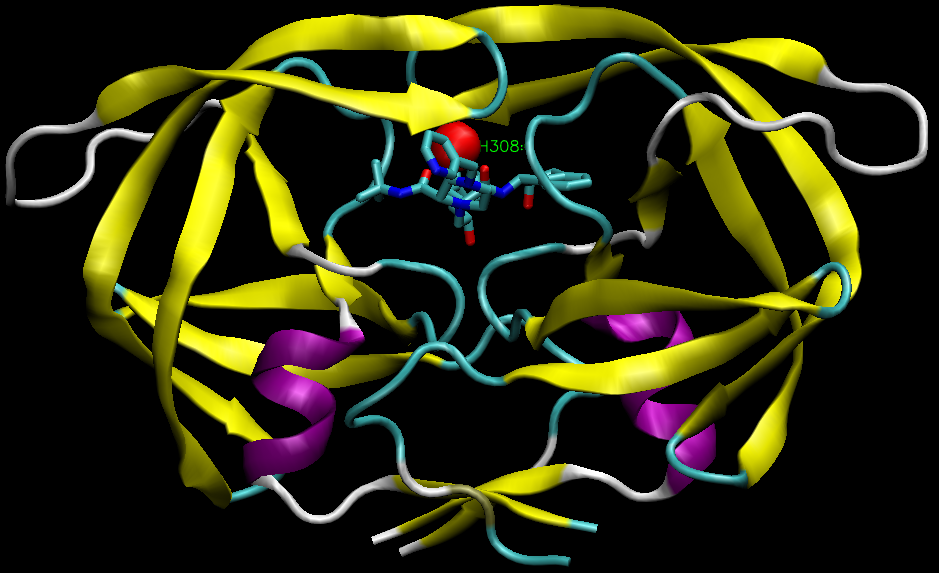

```{r setup, include=FALSE}
knitr::opts_chunk$set(echo = TRUE)
```

## PDB database composition statistics

Download PDB stats data as CSV file from: http://www.rcsb.org/stats/summary

```{r}
pdbstats <- read.csv("Data Export Summary.csv", row.names=1)
```

Lets look at table
```{r}
library(knitr)
kable(pdbstats)
```

> Q1. Determine the percentage of structures solved by X-Ray and Electron Microscopy. What proportion of structures are protein?

```{r}
# total number of entries
nstru <- sum(pdbstats$Total)

precent <- round((pdbstats$Total / nstru)*100, 2)
```

A1. There are `r precent[1]` % X-ray structures and `r precent[5]` % EM structures in the PDB database as of `r Sys.Date()`.

```{r}
nstats <- pdbstats
nstats$Precent <- precent
kable(nstats)
```


The proportion of protein entries:
```{r}
round((sum(nstats$Proteins) / nstru)*100,2)
```

## Introduction to Bio3D

Any time we want to use a package we must load it with the **library()** function.

```{r}
library(bio3d)
```

```{r}
pdb <- read.pdb("1hsg")
pdb
```


Note that the attributes (+ attr:) of this object are listed on the last couple of lines. To find the attributes of any such object you can use:

```{r}
attributes(pdb)
```

Ww can access each componet with the dollar syntax. For example:

```{r}
head(pdb$atom)
```

```{r}
pdb$xyz
```

Plot of B-factor column

```{r}
plot.bio3d(pdb$atom$b[pdb$calpha], sse=pdb, typ="l", ylab="B-factor")
```

## Atom selection

We need to be able to get at select parts of protein structures (e.g. just the ligand, just the protein, or just chain A, etc.). For this we use the **atom.select()** function.

```{r}
# Select all C-alpha atoms (return their indices)
ca.inds <- atom.select(pdb, "calpha")
ca.inds
```

```{r}
head( pdb$atom[ca.inds$atom,] )
```

```{r}
head(pdb$atom)
```


```{r}

ligand.inds <- atom.select(pdb, "ligand")
ligand.inds
```


```{r}
head( pdb$atom[ligand.inds$atom,] )
```


```{r}
ligand.pdb <- atom.select(pdb, "ligand", value=TRUE)
write.pdb(ligand.pdb, file="MK1.pdb")
```

# VMD visualization

Here is a snapshot figure of HIV-1 Protease (PDB CODE: 1HSG) made with VMD.

{width=500px}


## Aligning multiple structures

```{r}
# Download some example PDB files
ids <- c("1TND_B","1AGR_A","1TAG_A","1GG2_A","1KJY_A","4G5Q_A")
files <- get.pdb(ids, split = TRUE)
```

Align these files

```{r}
# Extract and align the chains we are interested in
pdbs <- pdbaln(files, fit = TRUE)
```

```{r}
pdbs
```

View of these fit (i.e. superposed) structures
```{r}
library(bio3d.view)
library(rgl)

view(pdbs)
rglwidget(width=500, height=500)
```


Lets try PCA of these structures

```{r}
# Perform PCA
pc.xray <- pca(pdbs)

```

Look at results

```{r}
plot(pc.xray)
```

```{r}
 # Visualize first principal component
pc1 <- mktrj(pc.xray, pc=1, file="pc_1.pdb")
```

View structures along PC1

```{r}
view(pc1)
rglwidget(width=500, height=500)
```


