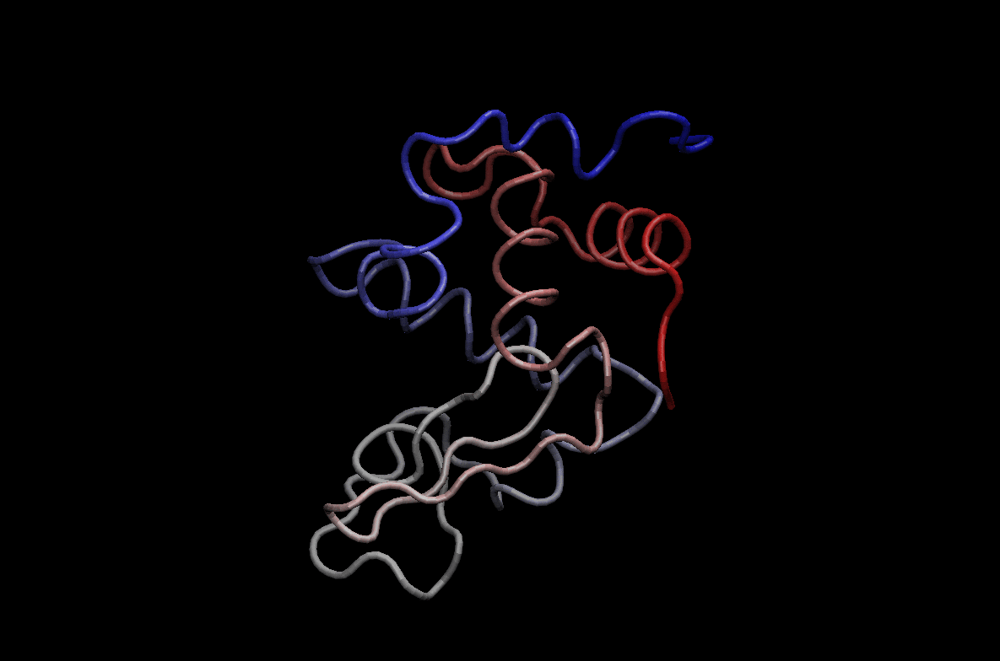

```{r setup, include=FALSE}
knitr::opts_chunk$set(echo = TRUE)
```

## Get HIV-Pr structure from PDB database

We will work with the structure `1HSG`
```{r}
library(bio3d)

file.name <- get.pdb("1hsg")
```

Read this into R and examine composition

```{r}
hiv <- read.pdb(file.name)
hiv
```

## Slit into seperate protein and ligand files

We will use the `trim.pdb()` function to split our input structure

```{r}
prot <- trim.pdb(hiv, "protein")
prot

```

```{r}
write.pdb(prot, file="1hsg_protein.pdb")
```

```{r}
lig <- trim.pdb(hiv, "ligand")
lig
```

```{r}
write.pdb(lig, "1hsg_ligand.pdb")
```

## Docking with Vina

We run this command:
`~/Downloads/autodock_vina_1_1_2_mac/bin/vina --config config.txt --log log.txt`

## Read docking results

We got a file all.pdbqt that we need to make into a PDB format.

```{r}
res <- read.pdb("all.pdbqt", multi=TRUE)
write.pdb(res, "results.pdb")
```

```{r}
res
```

To assess the results quantitatively we will calculate the RMSD (root mean square distance)
between each of the docking results and the known crystal structure using the bio3d package. Back in RStudio read the original ligand with added hydrogens that you produced earlier and
use the rmsd() function to compare to your docking results.


```{r}
ori <- read.pdb("ligand.pdbqt")
rmsd(ori, res)
```


## 3.1 Normal Mode Analysis (NMA)

Normal mode analysis (NMA) is one of the major simulation techniques used to probe large- scale motions in biomolecules. Typical application is for the prediction of functional motions in proteins.

Normal mode analysis (NMA) of a single protein structure can be carried out by providing a PDB object to the function nma(). In the code below we first load the Bio3D package and then download an example structure of hen egg white lysozyme (PDB id 1hel) with the function read.pdb(). Finally the function nma() is used perform the normal mode calculation:


```{r}
pdb <- read.pdb("1hel")
modes <- nma(pdb)
```

```{r}
plot(modes)
```


```{r}
mktrj(modes, mode=7, file="nma_7.pdb")
```


