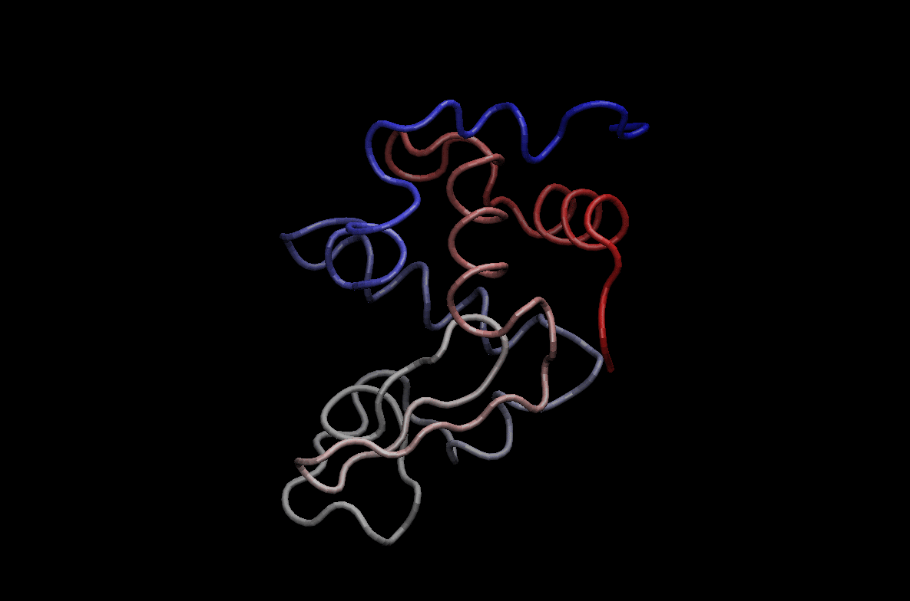

CLass13: Structural Bioinformatics II
================

Get HIV-Pr structure from PDB database
--------------------------------------

We will work with the structure `1HSG`

``` r
library(bio3d)

file.name <- get.pdb("1hsg")
```

    ## Warning in get.pdb("1hsg"): ./1hsg.pdb exists. Skipping download

Read this into R and examine composition

``` r
hiv <- read.pdb(file.name)
hiv
```

    ## 
    ##  Call:  read.pdb(file = file.name)
    ## 
    ##    Total Models#: 1
    ##      Total Atoms#: 1686,  XYZs#: 5058  Chains#: 2  (values: A B)
    ## 
    ##      Protein Atoms#: 1514  (residues/Calpha atoms#: 198)
    ##      Nucleic acid Atoms#: 0  (residues/phosphate atoms#: 0)
    ## 
    ##      Non-protein/nucleic Atoms#: 172  (residues: 128)
    ##      Non-protein/nucleic resid values: [ HOH (127), MK1 (1) ]
    ## 
    ##    Protein sequence:
    ##       PQITLWQRPLVTIKIGGQLKEALLDTGADDTVLEEMSLPGRWKPKMIGGIGGFIKVRQYD
    ##       QILIEICGHKAIGTVLVGPTPVNIIGRNLLTQIGCTLNFPQITLWQRPLVTIKIGGQLKE
    ##       ALLDTGADDTVLEEMSLPGRWKPKMIGGIGGFIKVRQYDQILIEICGHKAIGTVLVGPTP
    ##       VNIIGRNLLTQIGCTLNF
    ## 
    ## + attr: atom, xyz, seqres, helix, sheet,
    ##         calpha, remark, call

Slit into seperate protein and ligand files
-------------------------------------------

We will use the `trim.pdb()` function to split our input structure

``` r
prot <- trim.pdb(hiv, "protein")
prot
```

    ## 
    ##  Call:  trim.pdb(pdb = hiv, "protein")
    ## 
    ##    Total Models#: 1
    ##      Total Atoms#: 1514,  XYZs#: 4542  Chains#: 2  (values: A B)
    ## 
    ##      Protein Atoms#: 1514  (residues/Calpha atoms#: 198)
    ##      Nucleic acid Atoms#: 0  (residues/phosphate atoms#: 0)
    ## 
    ##      Non-protein/nucleic Atoms#: 0  (residues: 0)
    ##      Non-protein/nucleic resid values: [ none ]
    ## 
    ##    Protein sequence:
    ##       PQITLWQRPLVTIKIGGQLKEALLDTGADDTVLEEMSLPGRWKPKMIGGIGGFIKVRQYD
    ##       QILIEICGHKAIGTVLVGPTPVNIIGRNLLTQIGCTLNFPQITLWQRPLVTIKIGGQLKE
    ##       ALLDTGADDTVLEEMSLPGRWKPKMIGGIGGFIKVRQYDQILIEICGHKAIGTVLVGPTP
    ##       VNIIGRNLLTQIGCTLNF
    ## 
    ## + attr: atom, helix, sheet, seqres, xyz,
    ##         calpha, call

``` r
write.pdb(prot, file="1hsg_protein.pdb")
```

``` r
lig <- trim.pdb(hiv, "ligand")
lig
```

    ## 
    ##  Call:  trim.pdb(pdb = hiv, "ligand")
    ## 
    ##    Total Models#: 1
    ##      Total Atoms#: 45,  XYZs#: 135  Chains#: 1  (values: B)
    ## 
    ##      Protein Atoms#: 0  (residues/Calpha atoms#: 0)
    ##      Nucleic acid Atoms#: 0  (residues/phosphate atoms#: 0)
    ## 
    ##      Non-protein/nucleic Atoms#: 45  (residues: 1)
    ##      Non-protein/nucleic resid values: [ MK1 (1) ]
    ## 
    ## + attr: atom, helix, sheet, seqres, xyz,
    ##         calpha, call

``` r
write.pdb(lig, "1hsg_ligand.pdb")
```

Docking with Vina
-----------------

We run this command: `~/Downloads/autodock_vina_1_1_2_mac/bin/vina --config config.txt --log log.txt`

Read docking results
--------------------

We got a file all.pdbqt that we need to make into a PDB format.

``` r
res <- read.pdb("all.pdbqt", multi=TRUE)
write.pdb(res, "results.pdb")
```

``` r
res
```

    ## 
    ##  Call:  read.pdb(file = "all.pdbqt", multi = TRUE)
    ## 
    ##    Total Models#: 14
    ##      Total Atoms#: 50,  XYZs#: 2100  Chains#: 1  (values: B)
    ## 
    ##      Protein Atoms#: 0  (residues/Calpha atoms#: 0)
    ##      Nucleic acid Atoms#: 0  (residues/phosphate atoms#: 0)
    ## 
    ##      Non-protein/nucleic Atoms#: 50  (residues: 1)
    ##      Non-protein/nucleic resid values: [ MK1 (1) ]
    ## 
    ## + attr: atom, xyz, calpha, call

To assess the results quantitatively we will calculate the RMSD (root mean square distance) between each of the docking results and the known crystal structure using the bio3d package. Back in RStudio read the original ligand with added hydrogens that you produced earlier and use the rmsd() function to compare to your docking results.

``` r
ori <- read.pdb("ligand.pdbqt")
rmsd(ori, res)
```

    ##  [1]  0.590 11.163 10.531  4.364 11.040  3.682  5.741  3.864  5.442 10.920
    ## [11]  4.318  6.249 11.084  8.929

3.1 Normal Mode Analysis (NMA)
------------------------------

Normal mode analysis (NMA) is one of the major simulation techniques used to probe large- scale motions in biomolecules. Typical application is for the prediction of functional motions in proteins.

Normal mode analysis (NMA) of a single protein structure can be carried out by providing a PDB object to the function nma(). In the code below we first load the Bio3D package and then download an example structure of hen egg white lysozyme (PDB id 1hel) with the function read.pdb(). Finally the function nma() is used perform the normal mode calculation:

``` r
pdb <- read.pdb("1hel")
```

    ##   Note: Accessing on-line PDB file

``` r
modes <- nma(pdb)
```

    ##  Building Hessian...     Done in 0.016 seconds.
    ##  Diagonalizing Hessian...    Done in 0.076 seconds.

``` r
plot(modes)
```


``` r
mktrj(modes, mode=7, file="nma_7.pdb")
```

Add animation of mode!


